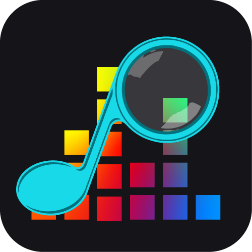
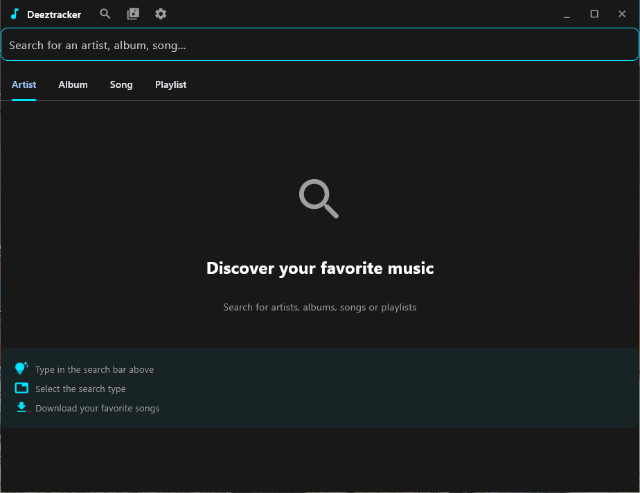
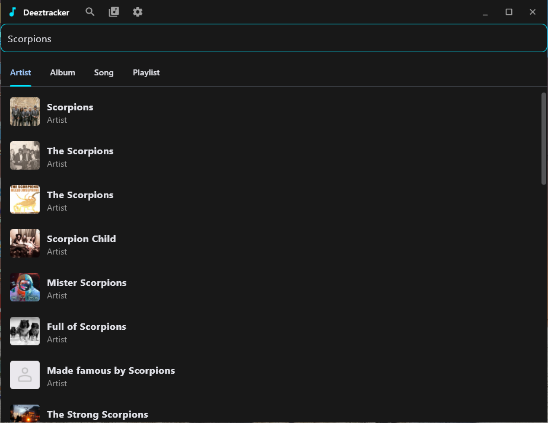
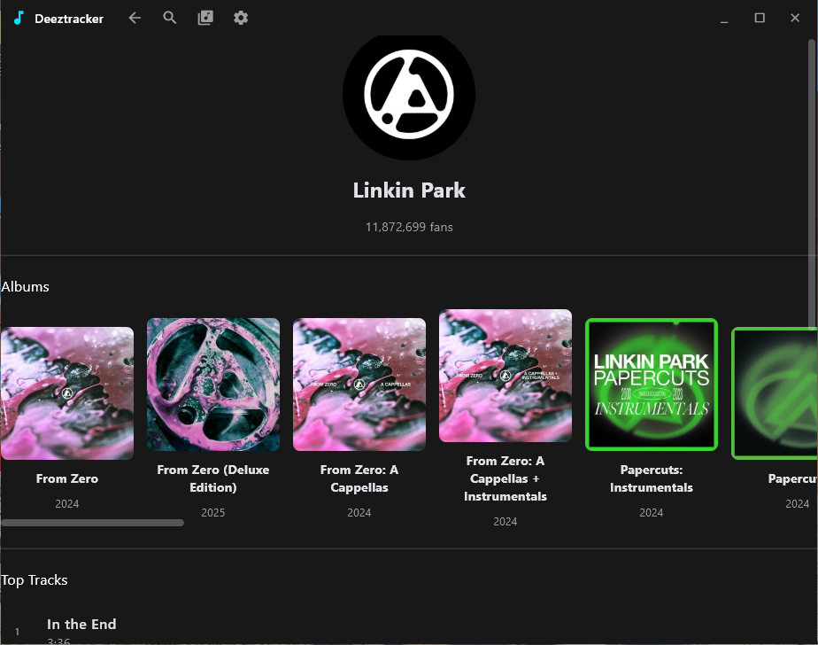
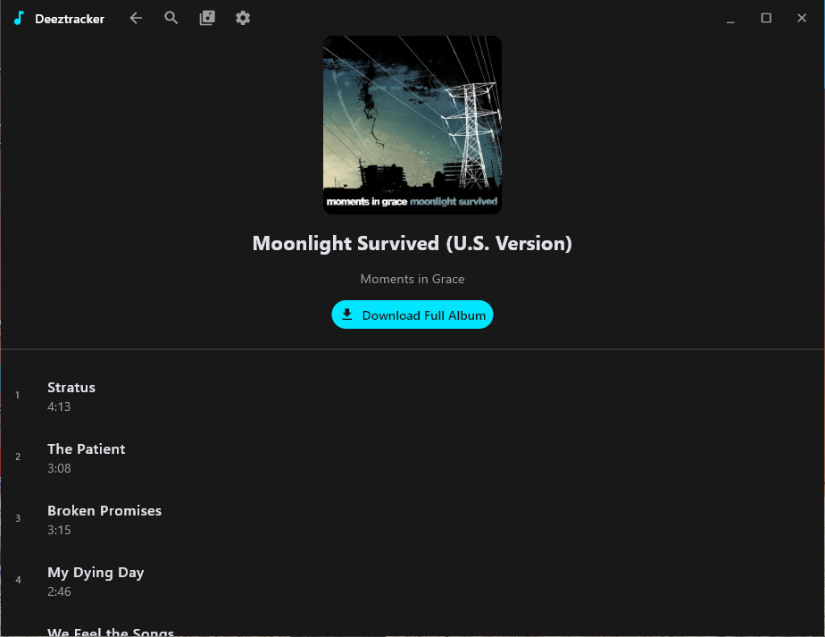
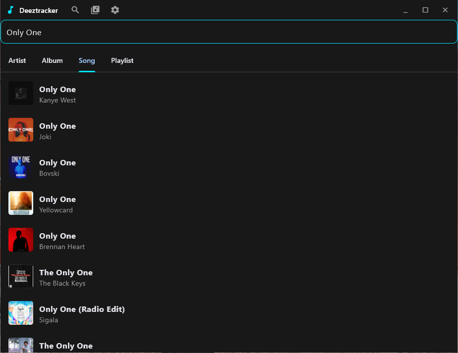
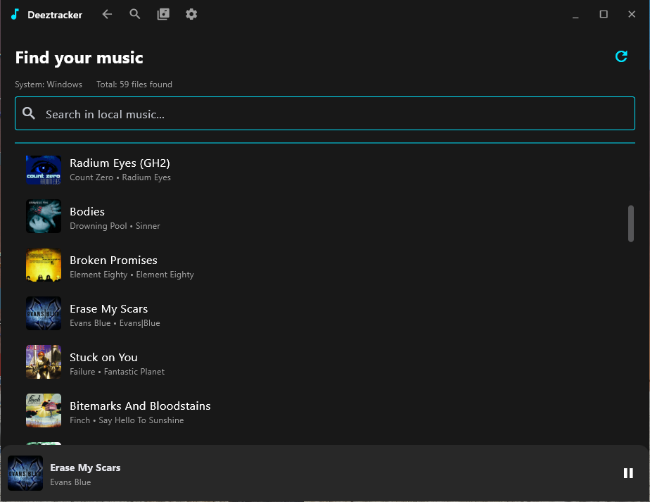
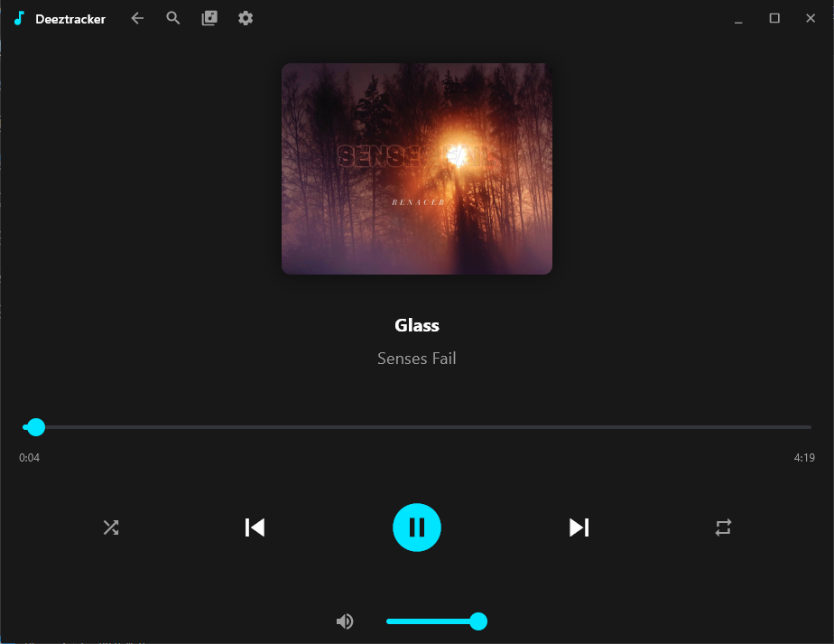

<div align="center">
  
</div>

# Deeztracker

A cross-platform desktop music player application that integrates with Deezer's streaming service. Built with Python and Flet, Deeztracker provides a native desktop experience for streaming and managing your Deezer music library with features like local music integration, custom playlists, and rich media controls.

## Screenshots

<div align="center">
  
  
</div>

<div align="center">
  
  
</div>

<div align="center">
  
  
</div>

<div align="center">
  
  
</div>


## Getting Started

### Obtaining Your Deezer ARL Token

To use Deeztracker, you need to obtain your Deezer ARL (Authentication Resource Locator) token from your browser cookies:

1. **Log in to Deezer**
   - Open your web browser and go to [deezer.com](https://www.deezer.com)
   - Sign in with your Deezer account

2. **Open Browser Developer Tools**
   - **Chrome/Edge**: Press `F12` or `Ctrl+Shift+I` (Windows/Linux) / `Cmd+Option+I` (Mac)
   - **Firefox**: Press `F12` or `Ctrl+Shift+I` (Windows/Linux) / `Cmd+Option+I` (Mac)

3. **Navigate to Cookies**
   - In the Developer Tools, click on the **Application** tab (Chrome/Edge) or **Storage** tab (Firefox)
   - In the left sidebar, expand **Cookies**
   - Click on `https://www.deezer.com`

4. **Find the ARL Cookie**
   - Look for a cookie named `arl` in the list
   - Click on it to view its value
   - Copy the entire value (it should be a long string of characters)

5. **Use the ARL in Deeztracker**
   - When you first launch Deeztracker, you'll be prompted to enter your ARL token
   - Paste the ARL value you copied from the cookies
   - Click "Login" to authenticate

> **Note**: Keep your ARL token private and secure. It provides access to your Deezer account.

## Packaging

### Linux

#### System Dependencies

To package the application on Linux, ensure you have the following system dependencies installed (names may vary by distribution, these are for Debian/Ubuntu):

- `vlc`
- `libvlc-dev`
- `libgirepository1.0-dev`
- `libcairo2-dev`
- `libdbus-1-dev`
- `libdbus-glib-1-dev`
- `pkg-config`
- `python3-dev`
- `gir1.2-gtk-3.0`

#### Build Command

```bash
uv run flet pack src/main.py \
  -i src/assets/icon_windows.png \
  --name Deeztracker \
  --debug-console DEBUG_CONSOLE \
  --add-binary "/usr/lib/x86_64-linux-gnu/libvlc.so.5:." \
  --add-binary "/usr/lib/x86_64-linux-gnu/libvlccore.so.9:." \
  --add-data "/usr/lib/x86_64-linux-gnu/girepository-1.0:girepository-1.0" \
  --add-data "/usr/lib/x86_64-linux-gnu/vlc/plugins:vlc_plugins" \
  --hidden-import "gi" \
  --hidden-import "gi.repository.GLib" \
  --hidden-import "dbus.mainloop.glib" \
  -y
```

### Windows

#### System Dependencies

Ensure VLC is installed on your system at the default location:
- `C:\Program Files\VideoLAN\VLC\`

The build process will copy the necessary VLC libraries and plugins into the packaged application.

#### Build Command

```powershell
uv run flet pack src/main.py -i src/assets/icon_windows.png --name "Deeztracker" --product-name "Deeztracker" --file-version "0.0.0.1" --add-binary "C:\Program Files\VideoLAN\VLC\libvlc.dll;." --add-binary "C:\Program Files\VideoLAN\VLC\libvlccore.dll;." --add-data "C:\Program Files\VideoLAN\VLC\plugins;plugins" -n "Deeztracker" -y
```
